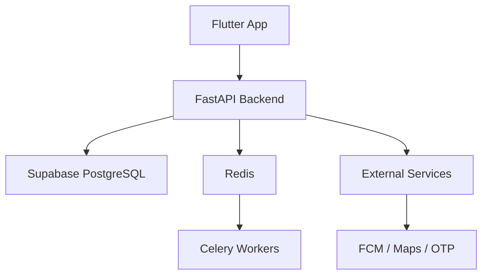
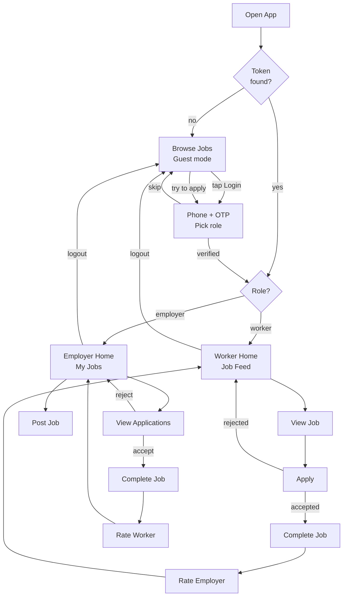

# Daily Wage Worker Job Board

A **mobile-first job marketplace** connecting **daily wage workers** (construction, cleaning, delivery, etc.) with **employers offering short-term or urgent work**.

Designed specifically for:
- Low-end Android devices  
- Slow or unreliable internet  
- Low-literacy users (icon-driven UX)

---

## Tech Stack

| Layer        | Technology |
|-------------|-----------|
| **Frontend** | Flutter (Android-first) |
| **Backend**  | FastAPI (Python 3.11+) |
| **Database** | Supabase (PostgreSQL + PostGIS) |
| **Cache**    | Redis |
| **Queue**    | Celery + Redis |
| **Auth**     | Phone OTP (Supabase / Twilio) + JWT |
| **Maps**     | OpenStreetMap + Nominatim |
| **Push**     | Firebase Cloud Messaging (FCM) |

---

## System Architecture

## User Flow Diagram

